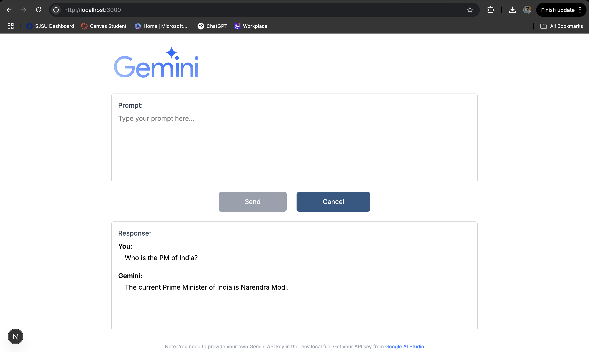

# Gemini AI Chat Application

A modern web application that integrates Google's Gemini 2.0 Flash-001 model to create an interactive chat interface. This application allows users to ask questions and receive intelligent responses powered by Google's advanced AI model.

## Screenshot



_Note: Replace this with your own screenshot after pushing to GitHub_

## Features

- Simple and intuitive chat interface
- Real-time interaction with Google's Gemini LLM
- Responsive design that works on desktop and mobile
- Server-side API handling for secure API key management
- Modern UI with Tailwind CSS

## Technologies Used

- Next.js 14
- TypeScript
- Tailwind CSS
- Google Generative AI SDK
- React Hooks for state management

## Getting Started

### Prerequisites

- Node.js 18.17.0 or later
- Google Gemini API key (get it from [Google AI Studio](https://aistudio.google.com/app/apikey))

### Installation

1. Clone this repository
   ```bash
   git clone https://github.com/your-username/gemini-chat-app.git
   cd gemini-chat-app
   ```
2. Install dependencies:
   ```bash
   npm install
   ```
3. Create a `.env.local` file in the root directory with your API key:

   ```
   # For server-side API route (more secure)
   GEMINI_API_KEY=your_api_key_here

   # For client-side usage (optional, less secure)
   NEXT_PUBLIC_GEMINI_API_KEY=your_api_key_here
   ```

### Running the Application

```bash
npm run dev
```

Visit [http://localhost:3000](http://localhost:3000) to use the application.

## How to Use

1. Type your question or prompt in the text area
2. Click "Send" to submit your query
3. The application will display Gemini's response in the response area
4. You can continue the conversation with additional prompts

## Deployment

This project can be easily deployed to Vercel or any other Next.js hosting platform:

```bash
npm run build
```

## GitHub Setup

To push this project to your own GitHub repository:

1. Initialize Git repository (if not already done):

   ```bash
   git init
   ```

2. Add all files to staging:

   ```bash
   git add .
   ```

3. Commit changes:

   ```bash
   git commit -m "Initial commit: Gemini Chat Application"
   ```

4. Create a new repository on GitHub

5. Connect and push to your remote repository:
   ```bash
   git remote add origin https://github.com/your-username/gemini-chat-app.git
   git push -u origin main
   ```

## License

This project is open source and available under the MIT License.

## Acknowledgements

- Google for providing the Gemini API
- Next.js team for the excellent framework
- Tailwind CSS for the styling utilities
